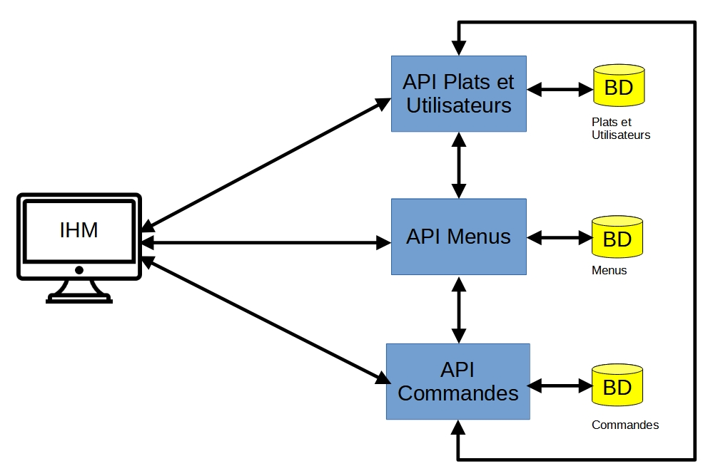

# MicroMeals

## Projet – Mise en pratique du patron Microservices

- TP sur machine en salle TP et à la maison
- Travail en groupe de 4 étudiants
- Compétence 1 – `développer`, Compétence 2 `administrer` et Compétence 6 – `collaborer`

## Le contexte

L’objectif de ce projet est de développer une application web pour une entreprise livrant des repas à des personnes inscrites. L’entreprise propose différents plats (p.ex. salade niçoise, aïoli, gratin dauphinois, etc.) et les clients peuvent combiner ces plats pour constituer des menus pour une personne. Les abonnés peuvent ensuite commander ces menus en ligne et ils leur sont livrés à domicile à une date précise. Le paiement se fera au moment de la livraison.

## L’application

### Description

L’application web devra permettre de visualiser les plats disponibles, leur description et leur prix. Elle devra permettre de composer des menus en y ajoutant/supprimant des plats. Le nom de la personne ayant créé le menu est enregistré, tout comme la date de création (ou de mise à jours). Les menus pourront ensuite être commandés par les abonnés (tous). Un abonné peut commander plusieurs menus dans les quantités souhaitées. Lorsqu’une personne validera une commande, l’application enregistrera les menus associés, enregistrera la date de commande, calculera leur prix au moment de la commande, et enregistrera l’adresse et la date de livraison.

Pour des questions de temps, on supposera que les fonctionnalités associées à l’enregistrement et la mise à jours des plats proposés par l’entreprise ne seront pas intégrées dans l’interface graphique de l’application, tout comme celles liées à l’inscription des abonnés. Par contre, elles seront implémentées dans l’application et prêtes à être intégrer dans l’interface graphique.

### Contraintes non fonctionnelles

L’application suivra une architecture orientée services (RESTful). Elle sera constituée des 4 composants logiciels suivants:

- le composant `IHM` gérera la partie interface graphique avec l’utilisateur;
- le composant `Plats et Utilisateurs` gérera l’accès aux données des plats et des utilisateurs;
- le composant `Menus` gérera les opérations sur les menus
- le composant `Commandes` gérera la partie commande
Le composant `IHM` sera codé en `HTML/CSS/PHP`. Les autres composants seront codés avec `Jakarata EE` sous forme d’`API REST` implémentant les opérations `CRUD`. Chaque composant sera codé indépendamment, par un étudiant différent, et utilisera une base de données dédiée.

Par ailleurs, le composant `Menus` devra consommer l’API mise à disposition par le composant `Plats et Utilisateurs` pour son fonctionnement (en évitant de dupliquer trop d’informations dans sa base de données).

Le composant `Commandes` consommera quant à lui l’API du composant `Menus`.

Le schéma suivant résume cette architecture:


### Développer son composant grâce à JSON-Server

Comme vous pouvez le constater, les API `Menus`, `Commandes` et `IHM` dépendent d’autres composants. Afin de ne pas devoir attendre le développement des composants associés, vous pourrez utiliser le logiciel JSON-Server. Il permet d’accélérer le prototypage de vos applications en imitant les APIs dont vous avez besoin, sans attendre que les autres membres du projet aient leurs endpoints opérationnels. Cet outil permet de créer un mock d’API REST en local en utilisant simplement un fichier JSON.

Plusieurs services ont été préparés pour ce projet. Vous n’avez plus qu’à les utiliser.

#### Services disponibles

| Service | Port | Données disponibles |
|---|---|---|
| Plats & Utilisateurs | 3003 | 8 plats, 4 utilisateurs |
| Menus | 3004 | 4 menus |
| Commandes | 3005 | 3 commandes |

Les fichiers de données JSON, tout comme la description des endpoints (au format YAML), sont disponibles dans le dossier `data/`.

#### Faire tourner le mock en local

1. Installer `docker` et `docker compose`.

2. Lancer chaque service.

Ouvrez trois terminaux (ou trois onglets) et lancez une commande dans chacun :
```bash
docker compose -f compose.plats.yml up --build
```
```bash
docker compose -f compose.menus.yml up --build
```
```bash
docker compose -f compose.commandes.yml up --build
```
Pour l'`IHM` :
```bash
docker compose -f compose.ihm.yml up --build
```
Ou tous les services en même temps :
```bash
docker compose -f compose.full.yml up --build
```
Pour arrêter tous les services :
```bash
docker stop $(docker ps -q)
```

Vos services sont maintenant disponibles sur :

| Compose | json-server | MySQL | phpMyAdmin |
|---|---|---|---|
| plats | [lien: 3003](http://localhost:3003) | [lien: 3306](http://localhost:3306) | [lien: 8081](http://localhost:8081) |
| menus | [lien: 3004](http://localhost:3004) | [lien: 3306](http://localhost:3306) | [lien: 8082](http://localhost:8082) |
| commandes | [lien: 3005](http://localhost:3005) | [lien: 3306](http://localhost:3306) | [lien: 8083](http://localhost:8083) |
| full | voir les liens du haut | tous actifs | voir les liens du haut |

`IHM` : [lien: 8080](http://localhost:8080)

Note : json-server génère automatiquement des routes REST à partir des clés de premier niveau du fichier JSON (ex. /plats, /utilisateurs, etc.). Les requêtes GET, POST, PUT, DELETE sont toutes supportées, et les modifications sont persistées dans le fichier local.